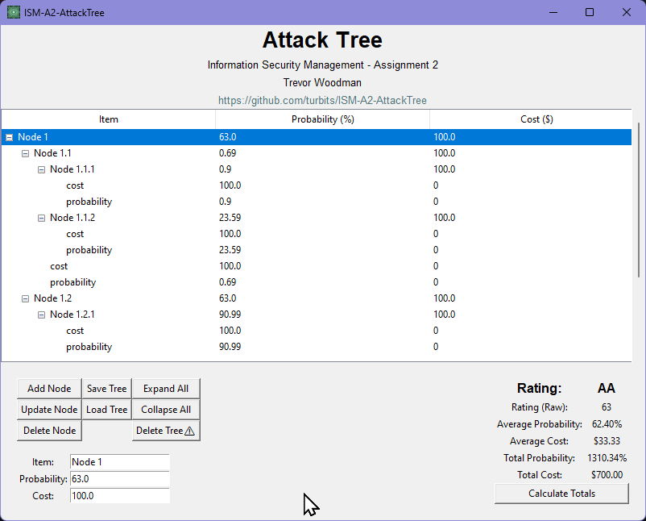
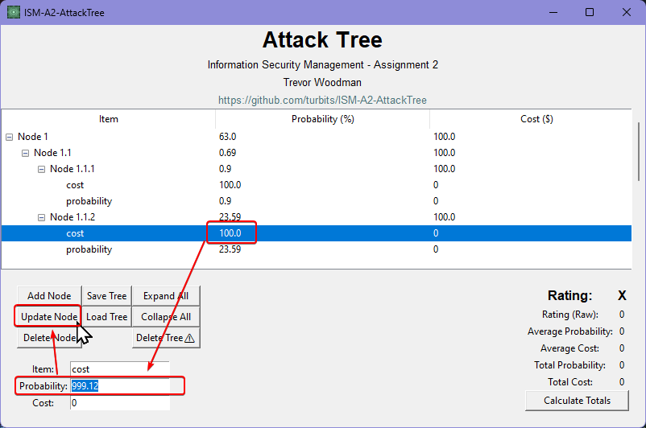
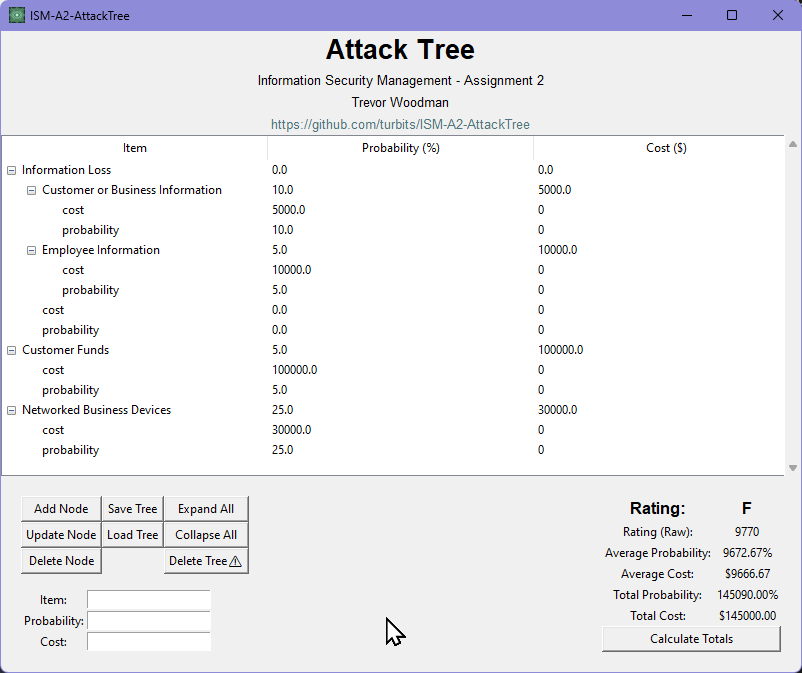
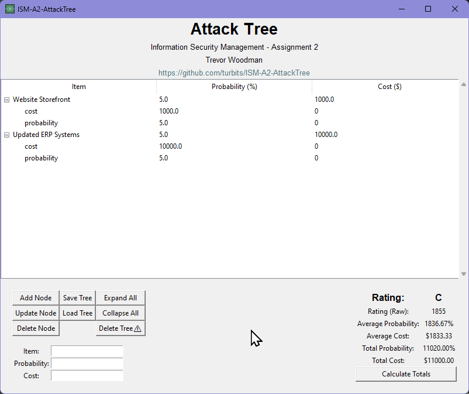
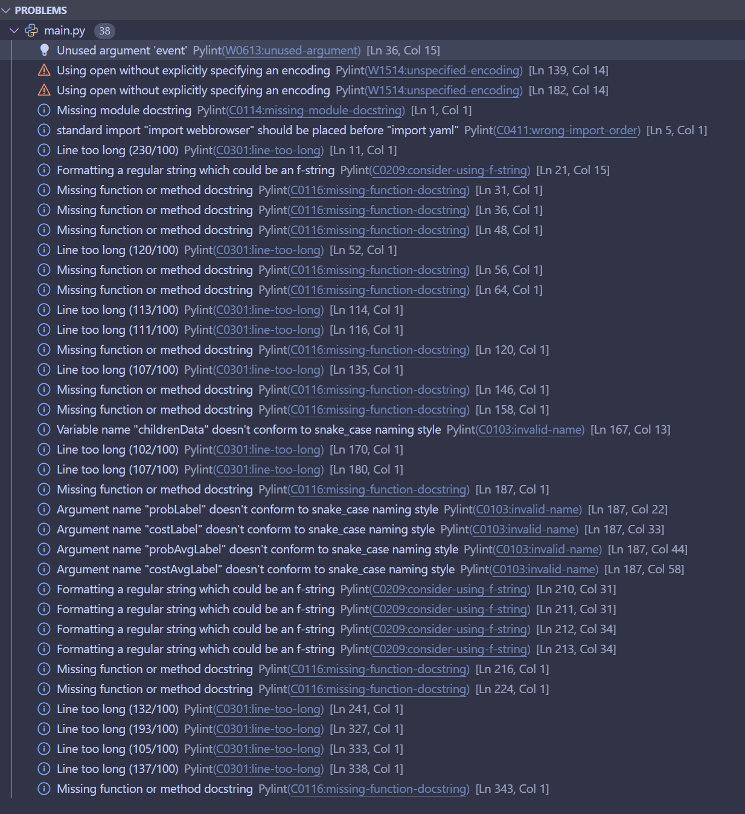

# ISM_PCOM7E Assignment 2 - Python Attack Tree Visualizer

**As this is submitted as was requested via a zip file, the GitHub repository may be easier to navigate: [https://github.com/turbits/ISM-A2-AttackTree](https://github.com/turbits/ISM-A2-AttackTree)**

<p align="center">
    
</p>

<p align="center">
    Icon for fun because you can use one in tkinter 🙉
</p>

*Software by Trevor Woodman / @turbits*


# Disclaimer
This application is a deliverable for the second assignment of the Information Security Management course at the University of Essex Online. It is a prototype/proof of concept and should never be used for any real-world security analysis.


# What is it?
This software is a deliverable for a university course, an attack tree visualizer that can be used to visualize attack trees in...you guessed it...a tree-like structure. As per requirements, I used `python (3.10+)` along with `tkinter`, and `pyyaml`. The software can load and save YAML attack trees and display them in a treeview, with the ability to add, update, and delete nodes. The software also calculates the totals and averages of the tree nodes for the "probability" and "cost" values.


# Prerequisites
- Tested on Python 3.10, 3.12
- PyYAML


# Installation
1. Clone the repository
2. Install the required packages
```bash
pip install pyyaml
```
3. Run the program
```bash
python main.py
```

# Operation


The main window of the program is shown above. The software consists of a treeview, buttons to interact with the treeview nodes, and the totals and averages of the tree node "probability" and "cost" values. For fun, I've included a rating system that is entirely arbitrary.


## Updating Nodes
The node interaction buttons are along the top row of buttons from left to right: Update, Delete, and Add. These three buttons allow the user to change or delete the selected node, and add a new node to the tree as a child of the selected node. When selecting a node in the tree, the Item, Probability, and Cost entry fields will be populated with the values of the selected node. The user can then update the node with new values if they wish.




## Loading and Saving Attack Tree Files
The Load and Save buttons allow the user to load and save YAML files from disk. The program will accept any valid YAML file, which could cause issues as it does not check for valid formatting. The user can also save the tree as a correctly formatted YAML file, which can be loaded back into the program at a later time.

A sample attack tree file is included in the repository as `test_attack_tree.yaml`. This file can be loaded into the program to see how the tree is displayed and how the program works. The correct structure is as follows:
```yaml
Node 1:
    Node 1.1:
        Node 1.1.1:
            cost: 100.0
            probability: 0.9
        cost: 100.0
        probability: 0.69
    cost: 45.0
    probability: 63.0
```

These keys can be in any order, as long as the "cost" and "probability" keys are present in the tree. There is a limitation at the moment that they must be populated with at least `0.0`, if no value is set then the tree will not populate correctly.


## Other Features
The Calculate Totals button updates the totals and averages of the tree nodes for the "probability" and "cost" values.
The user can also expand and collapse all nodes in the tree with the `Expand All Nodes` and `Collapse All Nodes` buttons, or delete the entire tree with the `Delete Tree` button.


## Software Issues and Limitations
- The averages are totally broken because of the way the tree gets populated/recursively parsed, please pretend they are correct :^)
- Does not support multiple selection node actions.
- The value display is a bit rough and could be improved to show $ or % on values.
- Nodes can't have the same name at the same level. e.g., from the test attack tree file, "Node 1" at root can't have a sibling called "Node 1".
- When adding a node, the program won't allow for a node to be named the same as the new node, even though the new node would be a child and not a sibling.
- Doesn't check for proper YAML formatting when loading a file, so if the file is not formatted correctly, the program may behave oddly or crash.
- Loading an attack tree file is a bit odd, as the tree shows the Node name, but with the cost and probability values as children of the node. Regardless, the tree is still functional and the totals and averages are being correctly calculated.
- The Risk Rating is arbitrary and based on the averages of the tree.


# Pampered Pets Pre and Post-Digitalization Attack Trees
The following are the attack trees for the Pampered Pets company, pre and post-digitalization. The attack trees are roughly based on my previous assignment [Assignment 1 - Repo](https://github.com/turbits/essex_eportfolio/tree/main/pages/module7/assignment1)/[Assignment 1 - ePortfolio](https://essex.trevorwoodman.ca/pages/module7/assignment1/m7a1.html), but have been modified to fit the requirements of the software and of the assignment. The numbers used here are arbitrary.


## Pre-Digitalization Attack Tree
```yaml
Information Loss:
  Customer or Business Information:
    cost: 5000.0
    probability: 10.0
  Employee Information:
    cost: 10000.0
    probability: 5.0
  cost: 0.0
  probability: 0.0
Customer Funds:
  cost: 100000.0
  probability: 5.0
Networked Business Devices:
  cost: 30000.0
  probability: 25.0
```



## Post-Digitalization Attack Tree
```yaml
Website Storefront:
  cost: 15000.0
  probability: 15.0
Updated ERP Systems:
  cost: 100000.0
  probability: 10.0
```




# Rating
The rating system I built into the software is absolutely arbitrary and I made the entire thing up while I was writing the `calculate_rating` function. It is based on the probability average and the cost average summed and divided by 100. The resulting number is then rounded up and run through a cascade of if statements to determine the "letter rating", which I thought would look nicer and be more readable than a number. The rating system (again, extremely arbitrary), is as follows:

| Raw Rating | Letter Rating |
|------------|---------------|
| 0 - 499   | AA            |
| 500 - 999 | A             |
| 1000 - 1499 | B             |
| 1500 - 2499 | C             |
| 2500 - 3999 | D             |
| 4000 - 7999 | E             |
| 8000+    | F             |

This may or may not produce results that are useful or meaningful, but it was a fun little thing to implement and could be expanded upon to be more useful and perhaps align with real-world risk rating systems.


# Testing and Linting


## Testing
Testing was a primarily manual process for this software and only basic testing was done, e.g.:
- Does this button do what it should?
- Does loading a correctly formatted YAML file populate the tree with correct values?
- Etc.

I tested the software by loading and saving various attack tree files, adding, updating, and deleting nodes, calculating the totals and averages of the tree nodes, and expanding and collapsing nodes in the tree. There are plenty of ways to break the software as it stands, but if the user is careful and follows the structure of the test attack tree file, the software should generally work as intended.


## Linting
I originally did not use linting, but have since added the `flake8` extension to vscode and had 13 initial linting warnings and informationals. They were primarily "expected X blank lines" and "blank line contains whitespace" in various places.

After, I installed `Pylint` as well and had 38 warnings and informationals. These were unused arguments, missing docstrings, import orderering, lines that were too long, etc. I have screenshotted and included below. I disabled some pylint warnings that I felt were not necessary to fix. I typically spend quite a bit of time using PowerShell and C#, so my variables were mostly using camel and pascal case, I did change these over to snake case to satisfy the linter and the Python style guide.



Personally I think the Python style guide and therefore linters are a bit too opinionated, but I also understand the value of having a consistent style across a codebase. Unfortunately, sometimes the linter has me making changes that break things, such as not passing an event argument into a function that is bound to the treeview select event:
```python
def on_select(event=None):  # <- event arg
    # [...]
```

Pylint flagged this as an unused argument and myself not knowing enough about tkinter removed it as part of the other lint changes I made. I was of course then confused as to why the function started throwing errors. Once I did a bit of research, I quickly found that the event argument is required for the function to work, but it was still not a great experience. This is a bit of a tangent, but I think it is important to note that linters can sometimes be a bit too opinionated and can cause issues for developers who are not so familiar with the language or the libraries they are using.


# References
- Roseman, M. (2022). TkDocs. Available at: https://tkdocs.com/tutorial/index.html [Accessed 05 March 2024]
- PyYAML. (N.D) PyYAML Website. Available at: https://pyyaml.org/ [Accessed 05 March 2024]
- Multiple Authors (2015). Stack Overflow: "How to center a window on the screen in Tkinter?". Available at: https://stackoverflow.com/questions/3352918/how-to-center-a-window-on-the-screen-in-tkinter [Accessed 05 March 2024]
- Elder, J. (N.D). Codemy.com YouTube Channel: Multiple videos on Python and Tkinter. Available at: https://www.youtube.com/watch?v=tvXFpMGlHPk [Accessed 05 March 2024]
- Multiple Authors (2010). Stack Overflow: "Tkinter button command activates upon running program?". Available at: https://stackoverflow.com/questions/3704568/tkinter-button-command-activates-upon-running-program [Accessed 06 Mar 2024]
