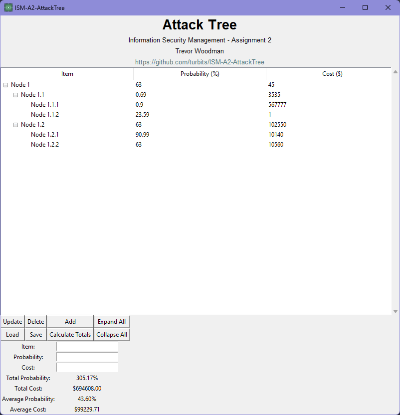

    <h1>Python Attack Tree Visualizer</h1>
    
    
Icon for fun because you can use one in tkinter 🙉

## Some feature notes:
- the program does not support multiple selection node actions
- the value display is a bit rough and could be improved to show $ or % on values
- nodes can't have the same name at the same level. e.g., from the test attack tree file, "Node 1" at root can't have a sibling called "Node 1"

The program is a functional attack tree visualizer that can be used to visualize attack trees in...you guessed it...a tree-like structure. I have used `tkinter` and `pyyaml` to create a GUI and to load/save attack tree files as YAML. The program is also capable of adding, deleting, and updating nodes in the tree via the GUI. 

# Operation

# References

- Roseman, M. (2022). TkDocs. Available at: https://tkdocs.com/tutorial/index.html [Accessed 05 March 2024]
- PyYAML. (N.D) PyYAML Website. Available at: https://pyyaml.org/ [Accessed 05 March 2024]
- Multiple Authors (2015). Stack Overflow: "How to center a window on the screen in Tkinter?". Available at: https://stackoverflow.com/questions/3352918/how-to-center-a-window-on-the-screen-in-tkinter [Accessed 05 March 2024]
- Elder, J. (N.D). Codemy.com YouTube Channel: Multiple videos on Python and Tkinter. Available at: https://www.youtube.com/watch?v=tvXFpMGlHPk [Accessed 05 March 2024]
